# KS5028 Xiao Zhi AI Chatbot with Camera DIY Kit
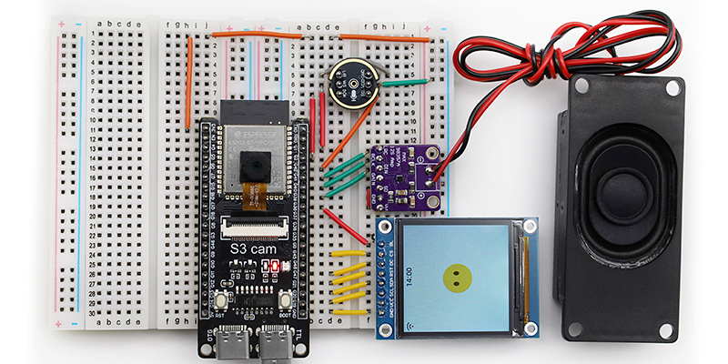

## Introduction
This is a DIY kit that uses simple hardware, voice recognition, and visual technology to quickly build a prototype of the "Xiao Zhi AI Chatbot (Vision Edition)" on a breadboard. It includes key components such as the **ESP32-S3-CAM development board**, camera, MEMS digital microphone (INMP441), digital amplifier (MAX98357A), cavity speaker, and more. It supports voice input and playback and adds **visual capabilities** to enable richer human-computer interaction features.

## Main Features
- **Enhanced Vision**: Integrates a camera module to give the AI robot "eyes," suitable for image recognition, surveillance, and other scenarios.
- **Easy to Build & Quick Start**: All components can be plugged into a breadboard without complex soldering skills.
- **Voice Input**: MEMS digital microphone (INMP441) effectively reduces environmental noise interference.
- **Audio Output**: The combination of digital amplifier (MAX98357A) and cavity speaker delivers clear voice playback.
- **Learning Friendly**: Hands-on assembly and debugging help deepen your understanding of basic AI voice and visual technology principles.

## Required Hardware

| Hardware Name | Specification/Model | Primary Use | Image |
| --- | --- | --- | --- |
| **Development Board** | **ESP32-S3-CAM** | **Main control board, responsible for running firmware, processing audio/video, and network connection** | 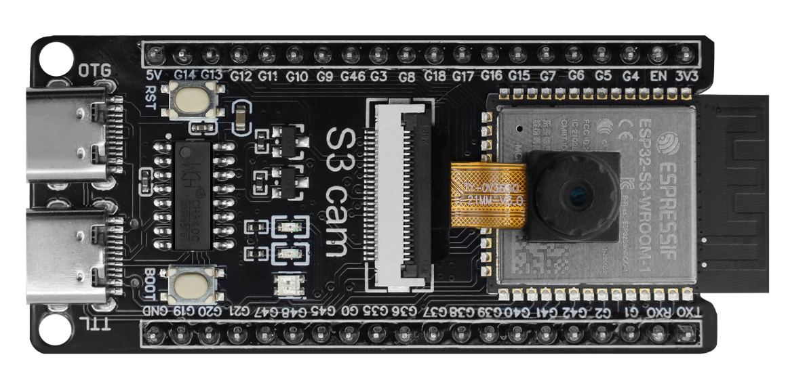 |
| Digital Microphone | INMP441 | Audio input capture | 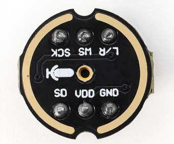 |
| Amplifier | MAX98357A | Audio output driver | 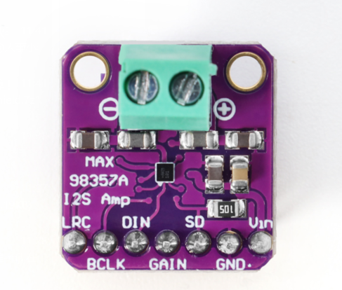 |
| Cavity Speaker | 8Ω 2~3W or 4Ω 2~3W | Speaker outputting sound | 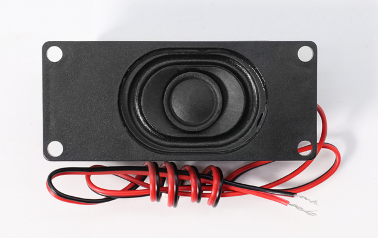 |
| Wires | A box of jumper wires, several Dupont wires | Connects modules and development board | 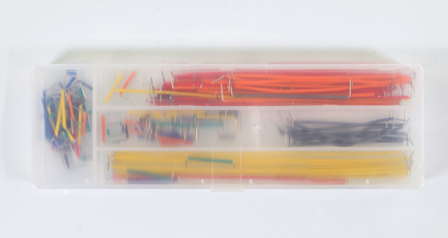 |
| Breadboards (2 pcs) | 400 holes, can be connected | Convenient for directly plugging in various electronic components | 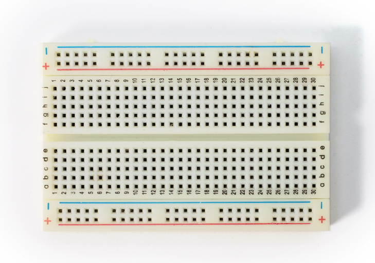 |
| Type-C Data Cable | For firmware flashing | Connects the development board to PC for firmware flashing and debugging | 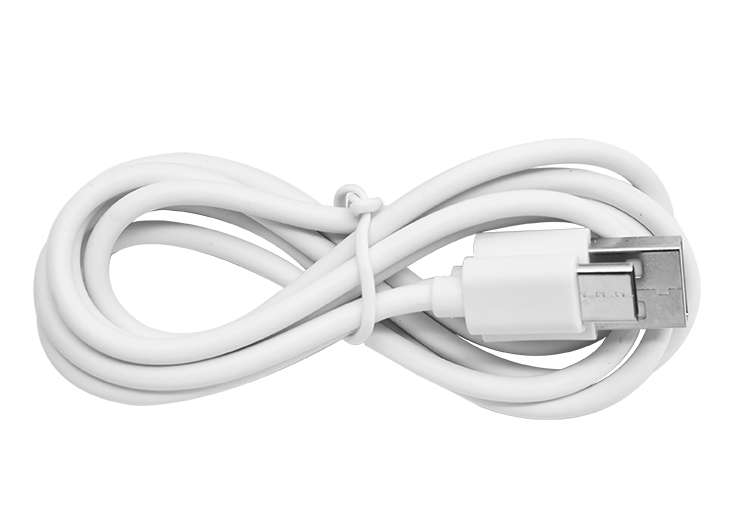 |

## Hardware Introduction

### 1. ESP32-S3-CAM Development Board
  
The ESP32-S3-CAM is a development board designed specifically for vision applications, based on Espressif's ESP32-S3 chip, integrating Wi-Fi and Bluetooth functionalities. It features an onboard camera interface, SD card slot, and multiple GPIO pins, making it an ideal choice for IoT cameras and visual recognition projects.

**Key Features**  
- **High-Performance Processing**: Equipped with Xtensa® LX7 dual-core processor running up to 240 MHz, supporting AI hardware acceleration.  
- **Camera Interface**: Onboard 24-pin camera connector, typically used with OV series cameras.  
- **Wireless Connectivity**: Integrated 2.4 GHz Wi-Fi and Bluetooth 5.0 (BLE).  
- **Rich Interfaces**: Besides the camera interface, multiple GPIO pins support I²S, I²C, SPI, UART protocols for connecting microphones, amplifiers, and other peripherals.  
- **Storage Expansion**: Some models include a built-in MicroSD card slot for storing images or firmware.

### 2. MEMS Digital Microphone (INMP441)
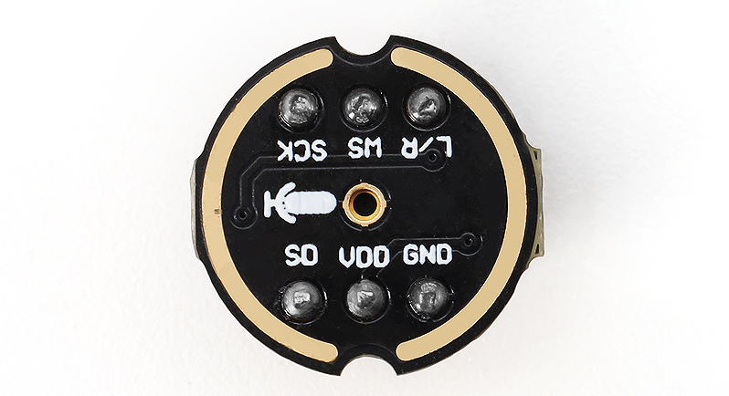  
The INMP441 is a high-performance, low-power digital MEMS microphone with an I²S interface. It outputs digital signals directly and has strong anti-interference capability, making it ideal for voice wake-up and AI voice interaction projects.

### 3. Digital Amplifier (MAX98357A)
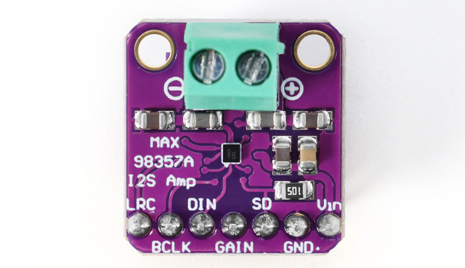  
The MAX98357A is a Class D audio power amplifier that also uses an I²S interface. It directly receives digital audio signals and drives the speaker without needing an external DAC, resulting in a simple circuit and high efficiency, ideal for portable audio devices.

### 4. Cavity Speaker (8Ω 2W)
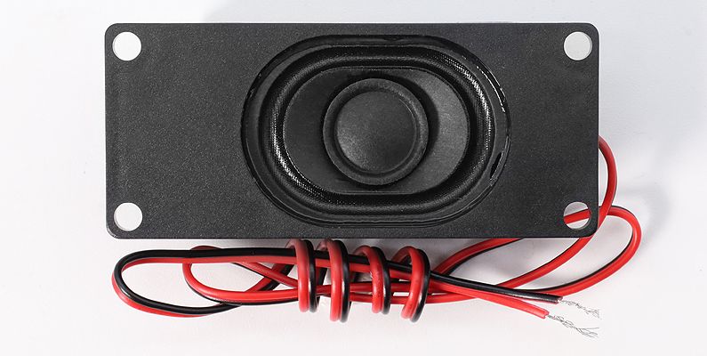  
A speaker with an independent sound cavity, capable of providing better sound quality and volume than a regular speaker, especially in mid and low frequencies.

### 5. Boxed Jumper Wires
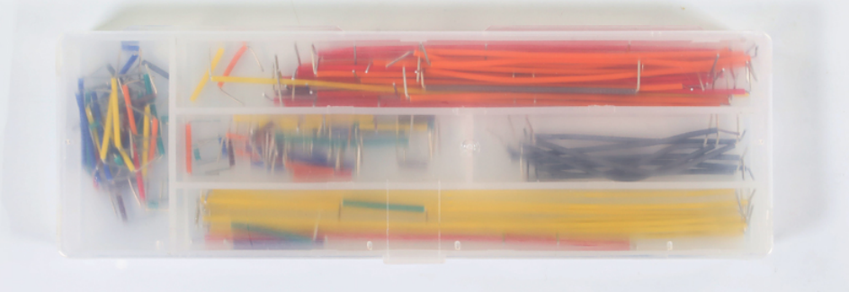  
The boxed jumper wires include various lengths and colors of Dupont wires, useful for quick assembly and connection on breadboards or circuit projects, making circuits clean and easy to debug.

### 6. Breadboard
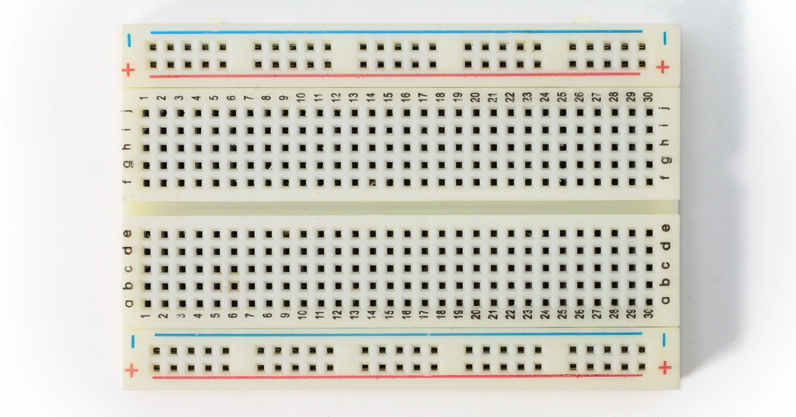  
Breadboards are used to quickly build and debug prototype circuits without soldering and effectively manage circuit connections. The 400-hole design is sufficient for common modules and jumper wires, allowing easy component plugging and layout adjustment.

---

# How to Wire

**Note:** Pin definitions for ESP32-S3-CAM boards may vary by manufacturer. Please refer to your board’s silkscreen markings or official documentation. The wiring below is a recommended example.

## ESP32S3-CAM Development Board Pin Connections to Modules

### 1. Wiring ESP32S3-CAM Board to Microphone
| **ESP32S3-CAM Board** | **Microphone INMP441 (I2S Interface)** |
| --- | --- |
| GPIO **1** | **WS** (Word Select) |
| GPIO **2** | **SCK** (Serial Clock) |
| GPIO **42** | **SD** (Data Output) |
| **3V3** | **VDD** (Power 3.3V) |
| **GND** | **GND** (Ground) **and short-circuit with** **L/R** |

---

### 2. Wiring ESP32S3-CAM Board to Digital Amplifier
| **ESP32S3-CAM Board** | **Digital Amplifier MAX98357A** |
| --- | --- |
| GPIO **39** | **DIN** (Digital Input) |
| GPIO **40** | **BCLK** (Bit Clock) |
| GPIO **41** | **LRC** (Left-Right Clock) |
| **3V3** / 3.3V | **Vin/VCC** (Power Input) **and short-circuit with** **SD** |
| **GND** | **GND** (Ground) |
| | **Audio+** connect to **Speaker Positive** |
| | **Audio-** connect to **Speaker Negative** |

---

### 3. Wiring ESP32S3-CAM Board to Camera
The camera is usually connected directly to the development board’s **24-Pin FPC Connector** via a flat cable, no manual wiring needed. Ensure the cable direction is correct (metal contacts facing down), gently insert and lock the clip.

---

## Wiring Step Tips
1.  **Secure the Main Board:** Insert the ESP32-S3-CAM development board into the center of the breadboard, leaving enough space on both sides to connect other modules.  
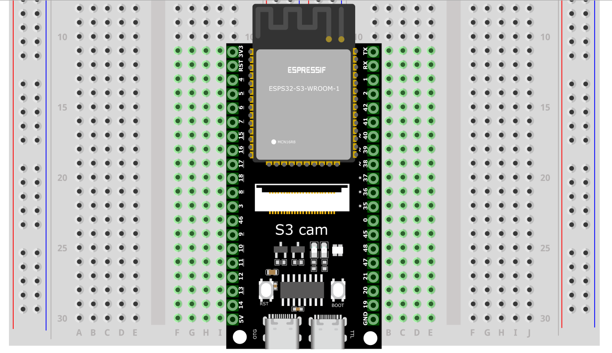

2.  **Connect the Microphone:** Strictly follow the wiring table above, use Dupont wires to connect the INMP441 microphone to the corresponding GPIO pins, 3V3, and GND on the development board.  
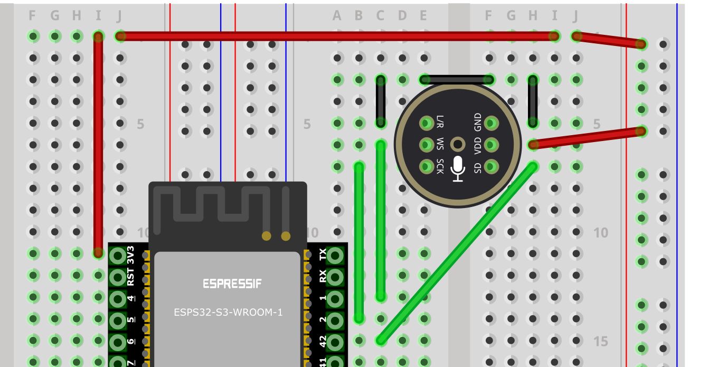

3.  **Connect the Amplifier:** Strictly follow the wiring table above, use Dupont wires to connect the MAX98357A amplifier to the corresponding GPIO pins, 3V3, and GND on the development board.  
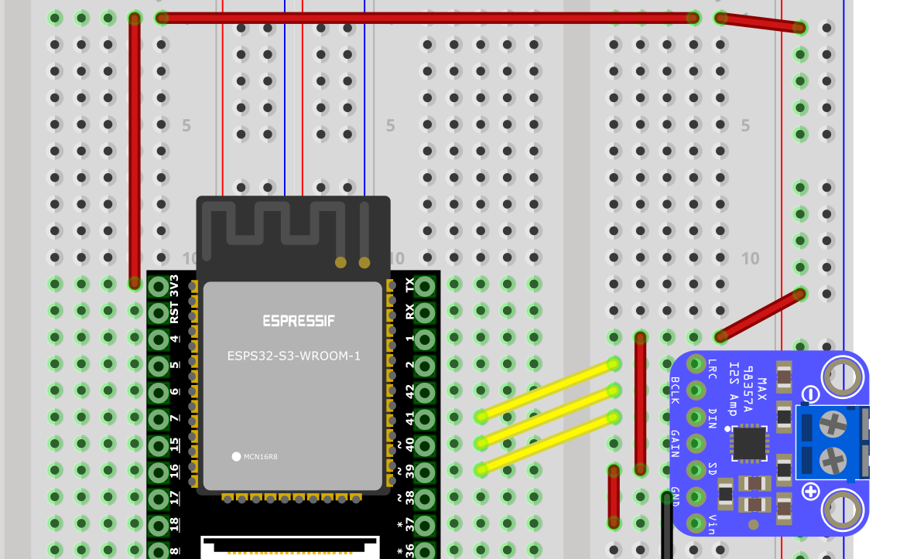

4.  **Connect the LCD Screen:** *(Note: This is an additional step. Please connect your LCD screen to suitable pins on the ESP32-S3-CAM according to your LCD screen’s model and pin definitions.)*  
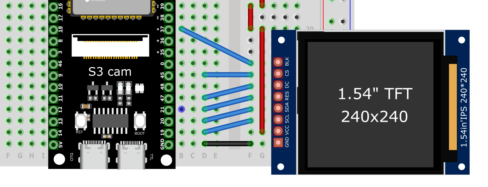

5.  **Connect the Speaker:** Connect the speaker wires to the MAX98357A amplifier’s `Audio+` and `Audio-` screw terminals or pins.

6.  **Check Wiring:** After completing, carefully verify every wire to ensure no incorrect connections or shorts.  
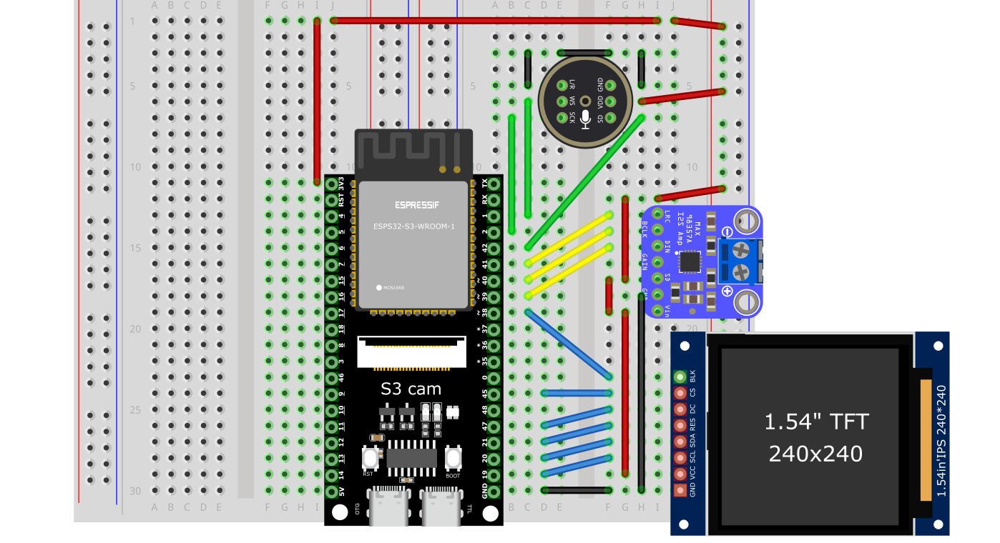

---
## Common Wiring Issues FAQ

1.  **RGB Light Does Not Light Up After Flashing Firmware**  
    *   Check if the solder points around the RGB LED are correctly soldered. Some boards may require shorting jumpers to enable the onboard RGB LED.

2.  **How to Check Circuit Faults?**  
    *   **Without power:** Use a multimeter to measure continuity between wires and GND or 3.3V pins to check for shorts or open circuits.  
    *   **With power:** Measure voltages between GND and other pins (e.g., 5V, 3.3V). If abnormal, continue tracing the corresponding module and wiring.

3.  **Frequent Poor Contact on Breadboard During Use?**  
    *   Possibly due to breadboard socket aging or component pin oxidation. Try replacing with a new breadboard, clean component pins, or use shorter jumper wires to reduce failure points.

4.  **How to Common Ground Sensors and Power Modules?**  
    *   The ground (GND) wire of external modules must be connected to the main board’s GND, all connected to the same ground line on the breadboard to avoid noise or unstable signals.

> **Tip:** If issues cannot be located, check whether the power supply is stable (e.g., 5V or 3.3V), and confirm that firmware version and example code align with actual wiring.

---

# Firmware Flashing

We provide two flashing methods: **Online Flashing** and **Using a Download Tool**. The recommended method is online flashing for convenience and speed.

---
## Method 1: Online Flashing (Web Flasher)
This method allows flashing firmware to the development board directly through the browser without downloading any tools.

**1. Preparation**  
- **Browser:** Use the latest version of **Google Chrome** or **Microsoft Edge**.  
- **Data Cable:** Ensure your Type-C cable supports data transfer and is not just a charging cable.

**2. Flashing Steps**  
1.  **Access the Flashing Page:** Open the online flashing URL in your browser: **https://flash.keyestudio.com/**  
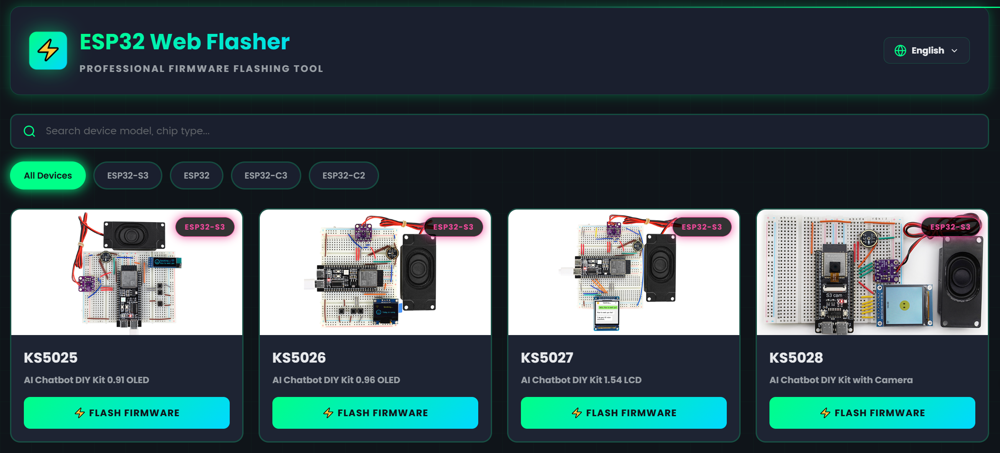

2.  **Connect Device:** Connect the KS5028 ESP32-S3-CAM development kit to your PC using the Type-C data cable.  
3.  **Connect Device on Webpage:**  
    -   Click the "**Connect Device**" button on the webpage.  
    -   The browser will prompt a device list window; select the corresponding **COM port** (e.g., `COM3`, `COM4`, etc.) of your device, then click “Connect.”  
4.  **Load Firmware:**  
    -   **Option A (Recommended):** Choose firmware from GitHub or Gitee in the firmware list, select the latest version, and click "**Download and Add**" to load it automatically.  
    -   **Option B:** If you have previously downloaded the firmware locally, click "**Upload Firmware**" to select and load your `.bin` file.  
5.  **Start Flashing:** After loading the firmware, click the "**Start Flashing**" button.  
6.  **Finish Flashing:** Wait for the progress bar to complete and the log to display messages like "Flashing Successful."

After flashing, press the `RST` button on your board to reboot the device, entering Wi-Fi configuration mode.

---

## Method 2: Using Flash Download Tool (No IDF Development Environment)

**Important:** This instruction applies to flashing firmware for **ESP32-S3-CAM** version. Please ensure you have downloaded the correct firmware file.

**One-Click Download Flashing Tool**

 [**Flashing Tool**](刷机工具.rar)

### 1. Preparation
- **Operating System:** Using Windows as an example, we recommend **Flash Download Tool 3.9.7** or newer.  
- **Obtain Tool:** Download from [Espressif Official Website](https://www.espressif.com.cn/zh-hans/support/download/other-tools), unzip anywhere, no installation needed.  
- **Run:** Open the extracted folder and double-click `flash_download_tool_3.9.7.exe` to start.  

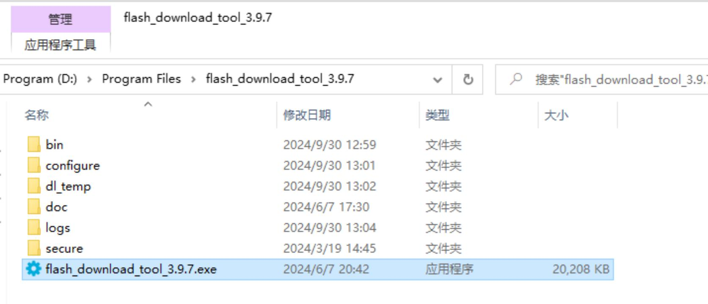

### 2. Download Firmware

**One-Click Download Firmware**

 [**Firmware**](刷机固件.zip)

### 3. Flash Firmware / Download to Board

Unzip and enter the `flash_download_tool` folder, double-click `flash_download_tool.exe`.

**1) Download Settings**

1.  **Chip Type:** Select `ESP32-S3`  
2.  **Work Mode:** Select `Develop`  
3.  **Download Mode:** Select `UART`

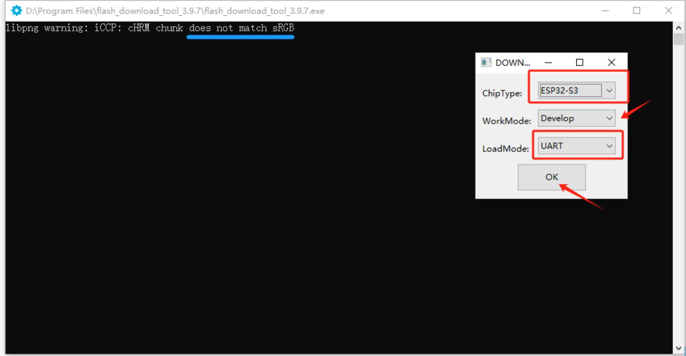

**2) Load Firmware & SPI Download Settings**

1.  **Load Firmware File:** Click the `...` button in the first blank box and select the `.bin` firmware file for the CAM board you downloaded.  
2.  **Check and Address Setup:** Tick the checkbox next to the loaded `.bin` file and enter `0x0` or `0x00` in the address field, indicating that flashing starts from the beginning of the memory.  
3.  **Select COM Port:** Connect the board via Type-C cable to the PC. Check the corresponding **COM port number** in Windows Device Manager and select the same port in the tool.  
4.  **Set Baud Rate:** Choose a higher baud rate (e.g., `921600`) for faster flashing.  
5.  **Enter Download Mode:** **Press and hold the BOOT (or IO0) button on the ESP32-S3-CAM board, then press the RST button once, and finally release the BOOT button.**  
6.  **Start Flashing:** Click `START`. The progress bar will run. Wait until the **FINISH** success message appears.

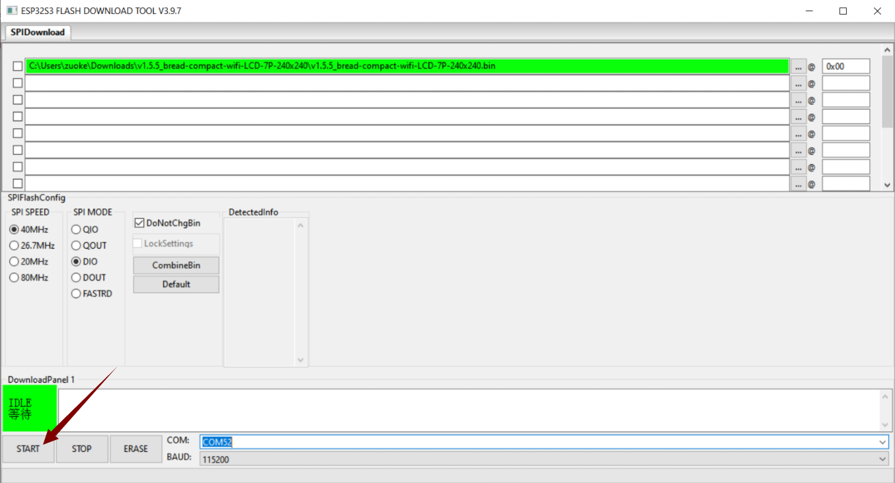

---

## Flashing Completed

After flashing, press the `RST` button on the development board to restart. The device will enter **Wi-Fi configuration mode**.

---

# How to Configure Device Wi-Fi

## 1. Wi-Fi Network Configuration

### 1) Start Device
- After flashing firmware and rebooting, the device enters configuration mode.

### 2) Configuration Status
- **sRGB LED blue blinking:** Indicates the device is in Wi-Fi configuration mode.  
- If the device is not in configuration mode, press and hold the **BOOT (or IO0)** button for a few seconds, or power cycle to enter configuration mode.

### 3) Configuration Steps
1.  **Connect to "Xiao Zhi" Wi-Fi**  
    Use your phone or computer to search for Wi-Fi and connect to the device’s hotspot (usually named *Xiaozhi-XXXXXX*).  
  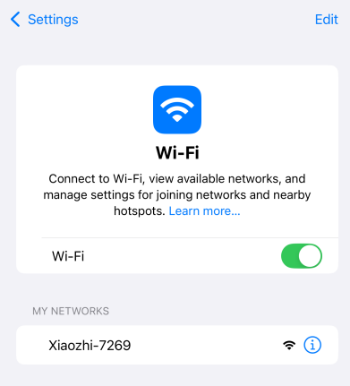

2.  **Configure Network**  
    After connecting, the phone typically auto-displays the configuration page. If not, open a browser and navigate to `http://192.168.4.1`.  
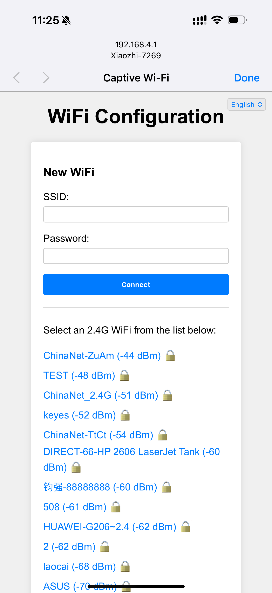  
    > - Select your 2.4G Wi-Fi network (5G is not supported).  
    > - Enter the Wi-Fi password and click **Connect**.  
    > - If the connection succeeds, the interface shows “Done,” and the device will reboot and connect to your Wi-Fi.

---

## 2. About the sRGB LED on the Device

1.  **Connection and Update Status**  
    -   **Blue flashing:** Device is in Wi-Fi configuration mode.  
    -   **Blue steady:** OTA firmware update in progress.  
    -   **Green flashing:** Wi-Fi connected successfully, waiting for wake-up.  
    -   **Blue light during voice wake-up:** Connecting to server.  
    -   **Green steady:** Playing voice.  
    -   **Red steady:** Recording audio.

2.  **sRGB LED Does Not Light**  
    -   Check if the development board power supply is normal.  
    -   Some boards may require additional soldering or jumper shorting to enable onboard sRGB LED, please check your board manual.

---

## 3. How to Add a Device

1. **Confirm Device Is Online**  
   - Once connected to the network, the device will announce a 6-digit verification code (can be retrieved by waking it up again).

2. **Access Control Panel**  
   - Open the [Xiao Zhi AI Chatbot - Control Panel](https://xiaozhi.me/) by entering [https://xiaozhi.me](https://xiaozhi.me) in your browser (register if you don’t have an account). Click the top right corner to switch to your preferred language.  
   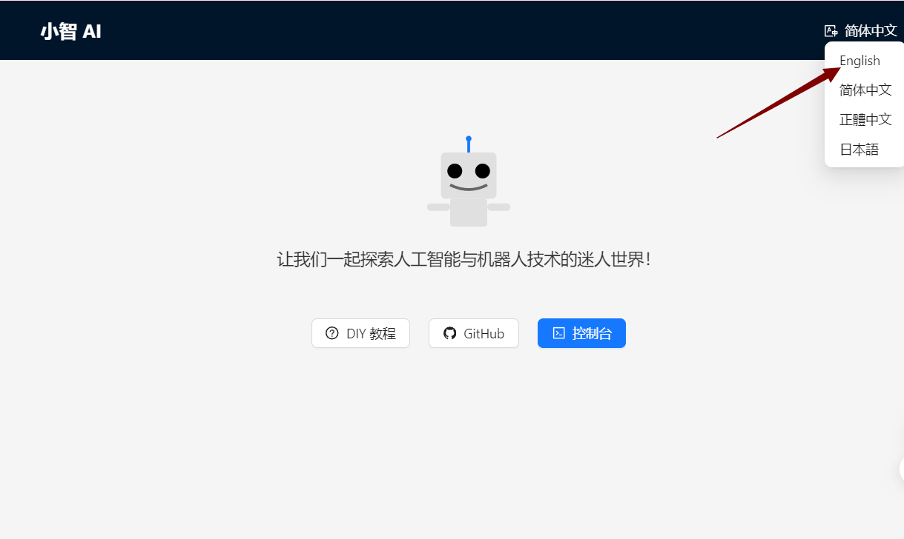

After changing the language, click **console** to enter the control panel.

3. **Device Management**  
   - Create an agent,  
   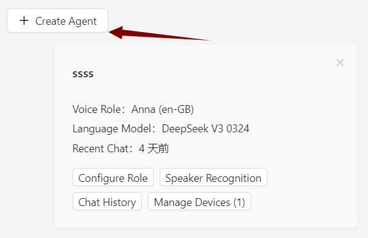

   - Set your agent's name.  
   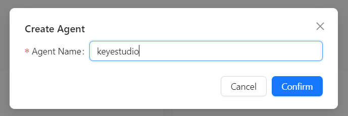

   - Click “Add New Device.”  
   
   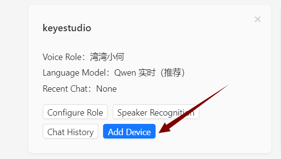  
   Enter the 6-digit **Device ID**.  

   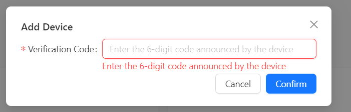  

   **Where to get the Device ID:** After firmware upload and network setup succeed, the device will announce this six-digit code automatically.

4. **Activation Successful**  
   - The device will activate automatically and appear in the “Device Management” page. Click **Configure Role** to open the configuration interface.  
   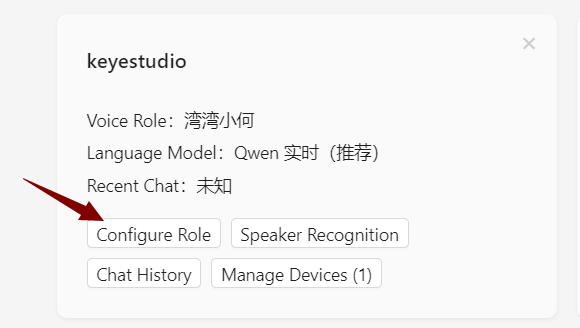

   - Set the assistant’s name and voice. In the Role Introduction section, you can use AI tools to write a character description as you like.  
   

   - Configure AI large models with several optional settings. After finishing, save your settings.  
   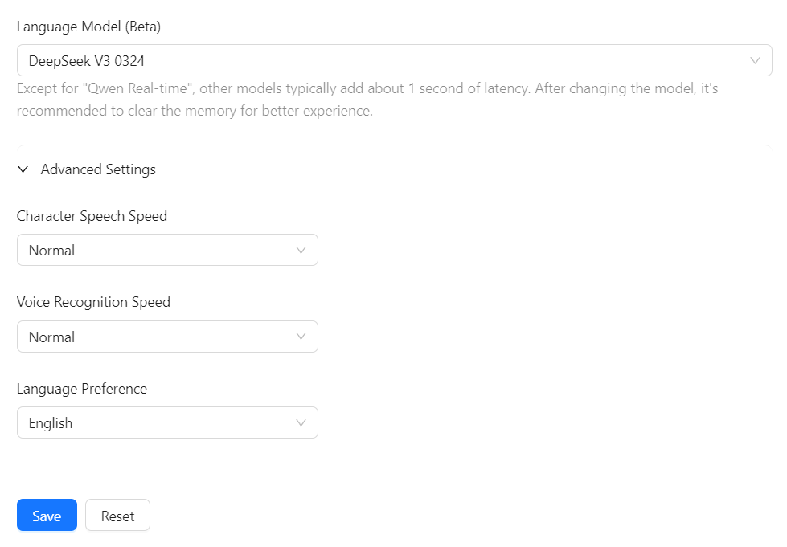

Restart the Xiao Zhi AI Chatbot and start chatting!